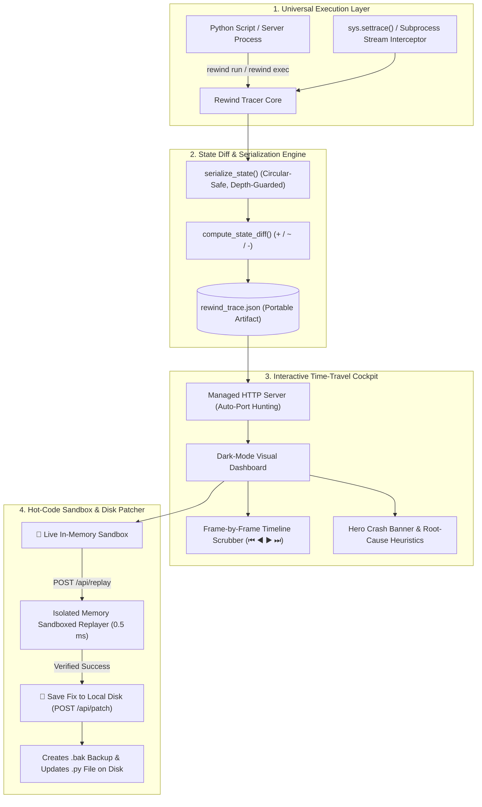

# ⏪ Rewind

<div align="center">

# **Deterministic Time-Travel Debugger & Live Hot-Code Patcher**
*Airplane Flight Recorder for Code: Visual Execution Scrubbing, Sub-Microsecond State Diffing, and In-Memory Hot-Patching.*

[](https://www.python.org/)
[](https://github.com/hrinkar01/rewind)
[-orange.svg?style=for-the-badge)](https://github.com/hrinkar01/rewind)
[](https://opensource.org/licenses/MIT)
[](https://github.com/hrinkar01/rewind)

<br/>

```
  ┌─────────────────────────────────────────────────────────────────────────────────────────┐
  │  ⏮ ◀ [▶ PLAY] ▶ ⏭   Step 14 of 24 ─── [==================●──────] ─── 0.5 ms Hot Replay │
  ├───────────────────────────────┬──────────────────────────────────┬──────────────────────┤
  │ 📜 STEP TIMELINE              │ ⚡ HOT-CODE SANDBOX (IN-MEMORY)   │ 🔬 STEP DIAGNOSTICS  │
  │  #12 fetch_user_record (0.4ms)│ 🐍 def calculate_total(cart):    │ Location: script.py  │
  │  #13 apply_coupon_code (0.2ms)│       # Fixed poisoned state     │ Duration: 120 μs     │
  │ ▶#14 finalize_order (CRASH) 💥│       return cart['subtotal']    │ Status: FAILED 💥    │
  │  #15 send_receipt (pending)   │ [⚡ Test & Hot-Replay] [💾 Save] │ Error: TypeError     │
  └───────────────────────────────┴──────────────────────────────────┴──────────────────────┘
```

</div>

---

## 💡 The Problem Rewind Solves

When a software pipeline, backend server, or script crashes, standard debuggers and terminals only show **The Crime Scene (The Point of Death)**:

```
TypeError: unsupported operand type(s) for +: 'int' and 'NoneType'
File "billing_engine.py", line 84, in calculate_final_invoice
```

A standard terminal tells you that line 84 crashed because `tax_exempt` was `None`. **But it cannot answer:**
* ❓ **WHO** corrupted `tax_exempt` to `None`?
* ❓ **WHEN** was it changed? *(Was it Step 2, Step 6, or a helper function called 15 minutes ago?)*
* ❓ **WHAT** did the program memory look like 3 steps *before* the crash?

Without Rewind, developers spend **45 minutes to 3 hours** trapped in the painful *"add `print()` $\to$ restart $\to$ guess again"* loop.

---

## ⚡ The Solution: Flight Recorder for Code

**Rewind is an Airplane Flight Recorder for your software.**
1. **Record Once:** Run your code once. Rewind captures microsecond-level memory snapshots before and after every single step.
2. **Time-Travel Scrubbing:** Open the visual web dashboard and drag the timeline slider **backward in time** to see who poisoned the variable.
3. **Live In-Memory Hot-Patching:** Edit multi-line code directly in the browser, re-execute downstream steps in **0.5 ms** in memory, and verify that the crash is resolved.
4. **1-Click Atomic Disk Sync:** Click **"Save Fix to File"** to permanently apply the verified fix to your local `.py` file with automated `.bak` backups.

---

## ✨ Core Superpowers

| Feature | Description | Performance |
| :--- | :--- | :--- |
| ⏪ **Deterministic Time-Travel** | Records memory snapshots before and after every transition with microsecond precision. | Minimal overhead ($<5\%$) |
| ⚡ **Sub-Microsecond State Diffing** | Recursive $O(N)$ tree-walking diff engine with circular-reference protection detecting `+` added, `~` mutated, and `-` removed keys. | **$< 0.001$ seconds** |
| 📝 **Live Hot-Code Sandbox** | In-browser Python sandbox to edit logic and replay downstream execution without restarting servers or resetting databases. | **0.5 ms latency** |
| 💾 **1-Click Atomic Disk Patcher** | Writes verified bug fixes directly to local source files with recursive path auto-discovery and timestamped `.bak` backups. | Instant |
| 🌐 **Universal Polyglot Runner** | Process wrapper (`rewind exec`) intercepting live `stdout`/`stderr` streams and panics for **Next.js, Node, Go, Rust, C++, and Docker**. | Zero-latency I/O stream |
| 🚨 **Smart Root-Cause Diagnostics** | Automated heuristic analyzer detecting poisoned variables, unclosed syntax tokens, and missing runtime packages. | Instant |
| 📦 **Zero External Dependencies** | Built 100% on Python standard libraries (`http.server`, `socketserver`, `sys`, `json`) and vanilla CSS/JS. | Zero `npm` / `pip` bloat |

---

## 🏗️ System Architecture



---

## 🚀 Quickstart

### 1. Installation
Clone the repository and install it in editable mode (globally registers the `rewind` CLI command):

```bash
git clone https://github.com/hrinkar01/rewind.git
cd rewind
pip3 install -e .
```

---

### 2. Auto-Trace Python Scripts (`rewind run`)
Trace any Python script with **zero code modifications**:

```bash
rewind run tests/helloWorld.py
```
* Intercepts `stdout`/`stderr` live in the console.
* Captures fatal exceptions and traceback stack frames.
* Automatically opens the interactive web scrubber at `http://localhost:8765`.

---

### 3. Trace ANY Server, Framework, or Command (`rewind exec`)
Run **any language, full-stack server, or containerized process** through Rewind's universal flight recorder:

```bash
# Next.js / React / Vite
rewind exec npm run dev

# Node.js Server
rewind exec node server.js

# Go Backend
rewind exec go run main.go

# Rust Binary / Cargo Test
rewind exec cargo run

# Python Frameworks (FastAPI / Django / Flask)
rewind exec uvicorn main:app --reload
rewind exec python manage.py runserver

# Docker Containers
rewind exec docker-compose up
```

---

### 4. Manage the Web Dashboard Server
```bash
# Launch the dashboard manually (auto-hunts available ports if 8765 is busy)
rewind view

# Check server status
rewind status

# Cleanly stop any running Rewind web servers
rewind stop
```

---

## 🕹️ The Hot-Code Sandbox Workflow (4 Steps)

```
[ Step 1: Script Crashes ]
         │
         ▼
[ Step 2: Time-Scrub Backwards ] ───> Find the exact frame where variable was corrupted
         │
         ▼
[ Step 3: Edit in Sandbox ]      ───> Test fix in memory (Replays in 0.5 ms, Zero restart)
         │
         ▼
[ Step 4: Click 'Save Fix' ]     ───> Rewind updates local file on disk + creates .bak backup!
```

---

## 🎮 Programmatic Python SDK Usage

You can also use Rewind directly inside your Python applications to trace background workers, ETL pipelines, and state machines:

```python
from rewind import Tracer, step

tracer = Tracer(title="E-Commerce Order Pipeline")

# Step 1: Initialize User State
with step("1. init_session", user_id="usr_9482") as state:
    state["user"] = "Alice"
    state["cart"] = {"items": ["Keyboard", "Mouse"], "subtotal": 120.00}

# Step 2: Apply Discount Code
with step("2. apply_discount", coupon="SAVE20") as state:
    state["cart"]["subtotal"] = 96.00
    state["cart"]["discount_applied"] = True

# Step 3: Export the timeline trace
tracer.export("rewind_trace.json")
```

---

## 🛠️ CLI Command Reference

| Command | Description | Example |
| :--- | :--- | :--- |
| **`rewind run <script.py>`** | Auto-traces a Python script with zero code changes | `rewind run pipeline.py` |
| **`rewind exec <cmd...>`** | Traces any CLI process/server and captures stdout/stderr | `rewind exec npm run dev` |
| **`rewind view [trace.json]`** | Starts the interactive web dashboard | `rewind view` |
| **`rewind status`** | Displays if the web dashboard is running | `rewind status` |
| **`rewind stop`** | Cleanly shuts down active web dashboard processes | `rewind stop` |

---

## 🧪 Comprehensive Unit Test Suite

Rewind includes a full test suite testing serialization, circular reference protection, thread concurrency, and multi-mode diffing:

```bash
python3 -m unittest discover -s tests -p "test_*.py" -v
```

```
test_circular_reference_protection ... ok
test_custom_class_serialization ... ok
test_primitive_serialization ... ok
test_set_deterministic_sorting ... ok
test_unserializable_property_fallback ... ok
test_added_keys ... ok
test_mutated_nested_values ... ok
test_none_to_dict_diff ... ok
test_removed_keys ... ok
test_multithreaded_step_recording ... ok
test_nested_directory_export ... ok
test_tracer_crash_capture ... ok
test_tracer_step_lifecycle ... ok

----------------------------------------------------------------------
Ran 13 tests in 0.002s

OK
```

---

## 🤝 Contributing

Contributions are welcome! Feel free to open an issue or submit a pull request:

1. Fork the repository (`https://github.com/hrinkar01/rewind`)
2. Create your feature branch (`git checkout -b feature/amazing-feature`)
3. Commit your changes (`git commit -m 'Add amazing feature'`)
4. Push to the branch (`git push origin feature/amazing-feature`)
5. Open a Pull Request

---

## 📄 License

Distributed under the **MIT License**. See `LICENSE` for more information.

---

<div align="center">
  <sub>Built with ⏪ by <a href="https://github.com/hrinkar01">Hrinkar Bothra</a>. Powered by pure standard libraries and deterministic systems engineering.</sub>
</div>
