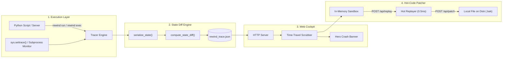

<div align="center">

# Rewind

### **Deterministic Time-Travel Debugger & Live Hot-Code Patcher**

*Automated Runtime State Inspection, Sub-Microsecond State Diffing, and In-Memory Hot-Patching for Developers.*

<br/>

[](https://www.python.org/)
[](https://github.com/hrinkar01/rewind)
[-ff6a3d?style=flat-square)](https://github.com/hrinkar01/rewind)
[](https://opensource.org/licenses/MIT)
[](https://github.com/hrinkar01/rewind)

<br/>

</div>

---

## The Problem Rewind Solves

When a software pipeline, server, or script crashes, standard debuggers and terminals only show **The Point of Death**:

```text
TypeError: unsupported operand type(s) for +: 'int' and 'NoneType'
File "billing_engine.py", line 84, in calculate_final_invoice
```

A standard terminal tells you that line 84 crashed because `tax_exempt` was `None`. **It cannot answer:**
* **WHO** mutated `tax_exempt` to `None`?
* **WHEN** was it changed? *(Step 2, Step 6, or a helper function called 15 minutes ago?)*
* **WHAT** did the program memory look like 3 steps *before* the crash?

Without Rewind, developers spend **45 minutes to 3 hours** trapped in the repetitive loop of adding `print()` statements and restarting from scratch.

---

## The Solution: Deterministic Time-Travel Execution

> [!IMPORTANT]
> **Rewind provides complete runtime state observability for your software.** Run your program once. If it crashes, open the visual cockpit, drag the timeline backward in time to inspect the exact memory state at each step, test a multi-line fix in memory in **0.5 ms**, and apply it directly to disk with 1 click.

### The 4-Step Hot-Code Workflow

1. **Deterministic Recording:** Rewind captures microsecond-level memory snapshots before and after every transition.
2. **Time-Travel Scrubbing:** Drag the timeline slider **backward in time** to find the exact frame where a variable was corrupted.
3. **Live Hot-Code Sandbox:** Rewrite broken logic directly in the browser dashboard and verify downstream steps in **0.5 ms** in memory.
4. **1-Click Atomic Disk Sync:** Click **"Save Fix to Local File"** to apply the fix directly to your source file with automatic `.bak` backups.

---

## Core Features

| Capability | What It Does | Performance |
| :--- | :--- | :--- |
| **Time-Travel Recording** | Captures before/after memory snapshots across transitions | Microsecond timing |
| **Sub-Microsecond Diffing** | Recursive $O(N)$ state comparator detecting `+` added, `~` mutated, and `-` removed keys | **$< 0.001$ seconds** |
| **Hot-Code Sandbox** | In-memory code patcher to test logic without restarting processes or resetting databases | **0.5 ms latency** |
| **1-Click Disk Patcher** | Writes verified fixes directly to local source files with recursive file discovery & backups | Instant |
| **Universal Process Runner** | Traces Python scripts and monitors **Next.js, Node, Go, Rust, C++, and Docker** processes | Live I/O stream |
| **Root-Cause Diagnostics** | Automated heuristic analyzer detecting poisoned variables and unclosed syntax errors | Instant |
| **Zero External Dependencies** | Built 100% on Python standard libraries and vanilla web technologies | Pure Stdlib |

---

## Architecture



---

## Quickstart

### 1. Installation

Clone the repository and install in editable mode:

```bash
git clone https://github.com/hrinkar01/rewind.git
cd rewind
pip3 install -e .
```

---

### 2. Auto-Trace Python Scripts

Trace any Python script with **zero code modifications**:

```bash
rewind run tests/broken_pipeline.py
```

* Intercepts `stdout`/`stderr` live in the console.
* Captures fatal exceptions and traceback stack frames.
* Automatically launches the interactive web scrubber at `http://localhost:8765`.

---

### 3. Trace Any Server, Framework, or Command

Run any language, framework, or containerized workflow through Rewind:

```bash
# Next.js / React / Vite
rewind exec npm run dev

# Node.js Server
rewind exec node server.js

# Go Backend
rewind exec go run main.go

# Rust Binary / Cargo Test
rewind exec cargo run

# Python Frameworks (FastAPI / Django / Flask)
rewind exec uvicorn main:app --reload
rewind exec python manage.py runserver

# Docker Containers
rewind exec docker-compose up
```

---

---

### 4. CI / Headless Mode for Automated Testing Pipelines

Run Rewind headlessly in CI/CD pipelines (GitHub Actions, GitLab CI, CircleCI) with zero GUI dependency:

```bash
# Returns exit code 1 on crash, 0 on clean pass, outputs structured step report
rewind run --ci tests/broken_pipeline.py

# Run headlessly on any subprocess or test runner
rewind exec --ci pytest tests/
```

---

### 5. Manage the Web Dashboard Server

```bash
# Start the web dashboard (auto-hunts free ports if 8765 is busy)
rewind view

# Check server status
rewind status

# Cleanly stop running Rewind servers
rewind stop
```

---

## Programmatic Python SDK

You can also instrument critical sections of your Python applications directly:

```python
from rewind import Tracer, step

tracer = Tracer(title="Payment Gateway Pipeline")

# Step 1: Initialize User State
with step("1. init_session", user_id="usr_9482") as state:
    state["user"] = "Alice"
    state["cart"] = {"items": ["Keyboard", "Mouse"], "subtotal": 120.00}

# Step 2: Apply Discount Code
with step("2. apply_discount", coupon="SAVE20") as state:
    state["cart"]["subtotal"] = 96.00
    state["cart"]["discount_applied"] = True

# Step 3: Export timeline for visual scrubbing
tracer.export("rewind_trace.json")
```

---

## CLI Reference

| Command | Description | Example |
| :--- | :--- | :--- |
| **`rewind run <script.py>`** | Auto-traces a Python script with zero code changes | `rewind run tests/broken_pipeline.py` |
| **`rewind exec <cmd...>`** | Traces any CLI process/server and captures stdout/stderr | `rewind exec npm run dev` |
| **`rewind view [trace.json]`** | Launches the interactive web dashboard | `rewind view` |
| **`rewind status`** | Checks if the web dashboard server is active | `rewind status` |
| **`rewind stop`** | Cleanly shuts down active web dashboard processes | `rewind stop` |

---

## Unit Test Suite

```bash
python3 -m unittest discover -s tests -p "test_*.py" -v
```

```text
test_circular_reference_protection ... ok
test_custom_class_serialization ... ok
test_primitive_serialization ... ok
test_set_deterministic_sorting ... ok
test_unserializable_property_fallback ... ok
test_added_keys ... ok
test_mutated_nested_values ... ok
test_none_to_dict_diff ... ok
test_removed_keys ... ok
test_multithreaded_step_recording ... ok
test_nested_directory_export ... ok
test_tracer_crash_capture ... ok
test_tracer_step_lifecycle ... ok

----------------------------------------------------------------------
Ran 13 tests in 0.002s

OK
```

---

## Contributing

Contributions are welcome! Please feel free to open an issue or submit a pull request:

1. Fork the repository (`https://github.com/hrinkar01/rewind`)
2. Create your feature branch (`git checkout -b feature/amazing-feature`)
3. Commit your changes (`git commit -m 'Add amazing feature'`)
4. Push to the branch (`git push origin feature/amazing-feature`)
5. Open a Pull Request

---

## License

Distributed under the **MIT License**. See `LICENSE` for details.

<div align="center">
  <sub>Built by <a href="https://github.com/hrinkar01">Hrinkar Bothra</a>.</sub>
</div>
