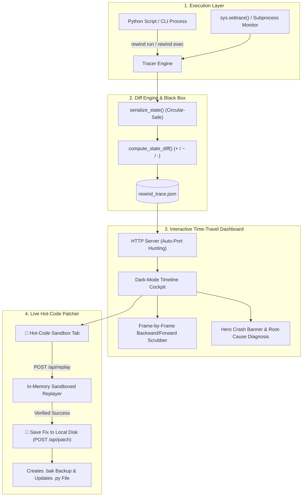

# ⏪ Rewind

<div align="center">

### **Deterministic Time-Travel Debugger & Live Hot-Code Patcher**
*Visual execution recording, sub-microsecond structural diffing, and in-memory hot-patching for Python & CLI workflows.*

[](https://www.python.org/)
[](https://opensource.org/licenses/MIT)
[](https://github.com/)
[-orange.svg?style=flat-square)](https://github.com/)
[](https://github.com/)

</div>

---

## 💡 Why Rewind?

When code crashes in production or local development, the terminal only shows you **The Crime Scene (The Crash)**:
```
TypeError: unsupported operand type(s) for &: 'NoneType' and 'bool'
File "pipeline.py", line 57, in finalize_invoice_ledger
```

A standard terminal tells you that line 57 died because `tax_exempt` was `None`. **But it cannot tell you:**
* ❓ **WHO** set `tax_exempt` to `None`?
* ❓ **WHEN** was it changed? (Was it at Step 1, Step 3, or in some helper function 10 minutes ago?)
* ❓ **WHAT** did the program memory look like 4 steps *before* the crash?

Without Rewind, developers spend **45 minutes to 3 hours** re-running scripts with print statements just to locate which step mutated the state.

**Rewind is an Airplane Flight Black Box for your code.** Run your program once. If it crashes, open the visual scrubber, drag the timeline backwards in time, catch the exact state corruption, test a multi-line fix in memory, and save it directly to disk with 1 click.

---

## ✨ Features

* ⏪ **Deterministic Time-Travel Recording:** Records snapshots before and after every execution step with microsecond precision.
* ⚡ **Sub-Microsecond Structural State Diffing:** Automatically identifies added (`+`), mutated (`~`), and deleted (`-`) keys across nested objects.
* 📝 **Live Hot-Code Time-Travel Sandbox:** Edit multi-line Python code directly in the browser UI, re-execute in memory from any past frame in **0.5 ms**, and verify fixes without restarting from Step 1.
* 💾 **1-Click Safe Disk Patcher:** Automatically writes verified code fixes directly into your local `.py` files with safe `.bak` backups.
* 🚨 **Smart Root-Cause Analysis:** Automated diagnostics that pinpoint poisoned variables, unclosed quotes, and missing dependencies.
* 🖥️ **Universal Zero-Config CLI:** Auto-trace Python scripts (`rewind run`), monitor any shell command/server (`rewind exec`), and manage server lifecycles (`rewind view`, `rewind stop`, `rewind status`).
* 📦 **Zero External Dependencies:** Built entirely with Python standard libraries (`http.server`, `socketserver`, `json`, `sys`) and vanilla CSS/JS.

---

## 🏗️ Architecture



---

## 🚀 Quickstart

### 1. Installation
Clone the repository and install it in editable mode (globally registers the `rewind` command):

```bash
git clone https://github.com/yourusername/rewind.git
cd rewind
pip install -e .
```

### 2. Auto-Trace Any Python Script
Trace any script with zero code modifications:

```bash
rewind run script.py
```
* Automatically records execution steps, captures crashes, saves `rewind_trace.json`, and launches the visual web dashboard.

### 3. Trace ANY Command (Node.js, Go, Rust, Docker, Shell)
Use the universal process runner:

```bash
rewind exec npm start
# or
rewind exec go run main.go
```

### 4. Manage the Web Viewer
```bash
# Start the web dashboard (auto-hunts free ports if 8765 is busy)
rewind view

# Check server health
rewind status

# Stop running servers cleanly
rewind stop
```

---

## 🎮 Programmatic SDK Usage

You can also use `rewind` as a Python library to instrument state machines, background workers, and ETL pipelines:

```python
from rewind import Tracer, step

tracer = Tracer(title="Payment Gateway Pipeline")

# Step 1: Initialize Session
with step("1. init_session") as state:
    state["user"] = "alice"
    state["cart"] = {"total": 1599.99, "tax_exempt": False}

# Step 2: Apply Discount
with step("2. apply_discount") as state:
    state["cart"]["total"] = 799.99

# Export trace for visual scrubbing
tracer.export("rewind_trace.json")
```

---

## 🛠️ CLI Reference

| Command | Description | Example |
| :--- | :--- | :--- |
| **`rewind run <script.py>`** | Auto-traces a Python script with zero code changes | `rewind run tests/helloWorld.py` |
| **`rewind exec <cmd...>`** | Traces any CLI process/server and captures stdout/stderr | `rewind exec npm test` |
| **`rewind view [trace.json]`** | Starts the interactive web dashboard | `rewind view` |
| **`rewind status`** | Displays if the web dashboard is running | `rewind status` |
| **`rewind stop`** | Cleanly shuts down the web dashboard | `rewind stop` |

---

## 🧪 Running Unit Tests

Rewind includes a comprehensive unit test suite covering state diffing, circular reference serialization, and execution tracer lifecycles:

```bash
python3 -m unittest discover -s tests -p "test_*.py"
```

Output:
```
Ran 9 tests in 0.001s
OK
```

---

## 🤝 Contributing

Contributions are welcome! Feel free to open an issue or submit a pull request.

1. Fork the repository
2. Create your feature branch (`git checkout -b feature/amazing-feature`)
3. Commit your changes (`git commit -m 'Add amazing feature'`)
4. Push to the branch (`git push origin feature/amazing-feature`)
5. Open a Pull Request

---

## 📄 License

Distributed under the **MIT License**. See `LICENSE` for more information.
